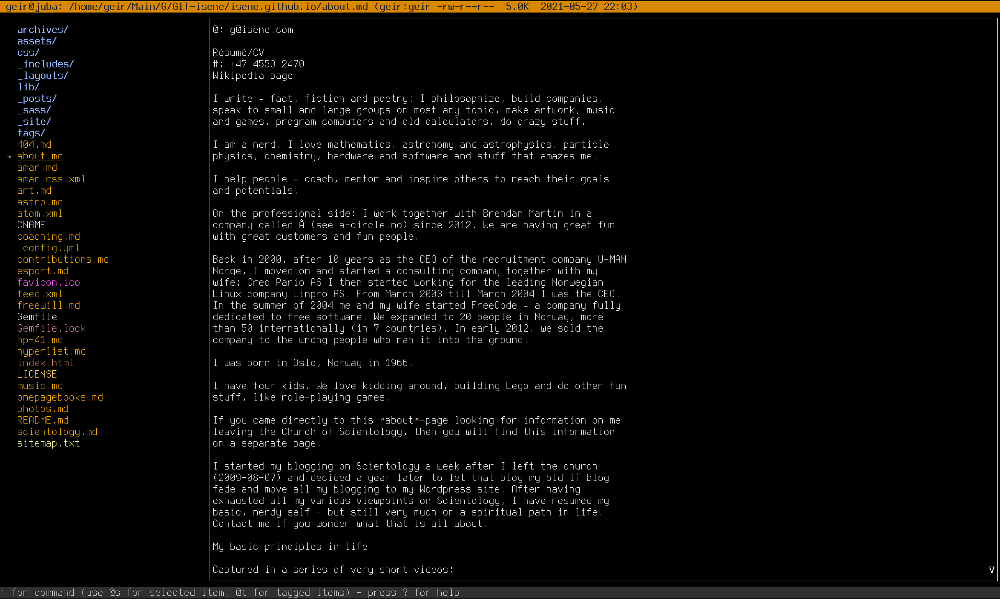

# RTFM - Ruby Terminal File Manager


## Why?
RTFM parses your LS_COLORS to ensure color consistency with the terminal experience.

The idea came to mind as I was working on [a complete
LS_COLORS setup](https://github.com/isene/LS_COLORS) with a corresponding
ranger theme. But making a separate theme for ranger to mimic a massive
LS_COLOR setup is rather stupid. File managers should parse LS_COLORS as
default rather than implement their own themes. This became an itch that
I kept scratching until I could happily replace ranger two weeks later.


## How?
RTFM is a two-pane file manager. You navigate in the left pane and the content
of the selected item (directory or file) is shown in the right pane. The right
pane is also used to show information such as the currently tagged items, your
(book)marks, output from commands, etc. You can run any command in the bottom
"command line" and have the output presented in the right pane.

In order to run RTFM (without generating [a bunch of
warnings](https://github.com/isene/RTFM/issues/1)), you need to do a `gem
install curses` (gets v 1.3.2) instead of installing via `apt install
ruby-curses` (gets v. 1.2.4-1build1 on Ubuntu 20.04). 

Content of text files are handled by `cat` - or by `bat` if you want beautiful
highlighting. Other files are shown via external programs. It is shown if you
have the program installed (Debian/Ubuntu family of Linux distros command in
last column):

File type                   | Requirements                     | Installation
----------------------------|----------------------------------|-------------------------------
Syntax highlighting of text | `bat`                            | `apt install bat`
PDFs                        | `pdftotext`                      | `apt install poppler-utils`
LibreOffice                 | `odt2txt`                        | `apt install odt2txt`
OOXML                       | `docx2txt`                       | `apt install docx2txt`
MS doc/xls/ppt              | `catdoc`, `xls2csv` and `catppt` | `apt install catdoc`
Images                      | `w3m` and `ImageMagick`          | `apt install w3m imagemagick`
Video (thumbnails)          | `ffmpegthumbnailer`              | `apt install ffmpegthumbnailer`


## Screenshot




## Keys
Key    | What happens when pressed
-------|-------------------------------------------------------------
?      | Show this help text
DOWN   | Go one item down in left pane (rounds to top)
UP     | Go one item up in left pane (rounds to bottom)
LEFT   | Go up one directory level
RIGHT  | Enter directory or open file (using run-mailcap or xdg-open)
PgDown | Go one page down in left pane
PgUp   | Go one page up in left pane
END    | Go to last item in left pane
HOME   | Go to first item in left pane
TAB    | Next page of the preview (if doc long and ∇ in the bottom right)
S-TAB  | Previous page (if you have moved down the document first - ∆ in the top right)
a      | Show all (also hidden) items
l      | Show long info per item (show item attributes)
G      | Show git status for current directory
t      | Tag item (toggles)
Ctrl-t | Add items matching pattern to list of tagged items
T      | Show currently tagged items in right pane
u      | Untag all tagged items
p      | Put (copy) tagged items here
P      | PUT (move) tagged items here
s      | Create symlink to tagged items here
d      | Delete selected item and tagged items. Press 'd' to confirm
c      | Change/rename selected (adds command to bottom window)
m      | Mark current dir (persistent). Next letter is the name of the mark [a-zA-Z']. Press '-' and a letter to delete that mark
M      | Show marked items in right pane
'      | Jump to mark (next letter is the name of the mark [a-zA-Z'])
h      | Jump to Home directory
/      | Enter search string in bottom window to highlight matching items
:      | Enter "command mode" in bottom window
;      | Show command history in right pane
L      | Start 'locate' search for files, then use '#' to jump to desired line/directory
ENTER  | Refresh the right pane
r      | Refresh RTFM (recreates all windows. Use when resizing windows or in case there is garbage somewhere)
q      | Quit
Q      | QUIT (without writing changes to the config file)


## A convenient shell function
Add this line to your `.bashrc` or `.zshrc` to make RTFM exit to the current
directory by launching the file manager via `r` in the terminal:

`source ~/.rtfm.launch`

... and place the file `.rtfm.launch` in your home directory.

With this, you can jump around in your directory structure via RTFM, exit to
the desired directory, do work in the terminal and go back into RTFM via `r`.


## Configuration file
When you first exit RTFM, it will write your (book)marks and the set of tagged
files to `.rtfm.conf`. This ensures your marks and tagged files are
persistent. It also means you can launch rtfm tag a bunch of dirs and files,
drop out back to the terminal to do some work, back into rtfm and resume to
work with your previously tagged items.

You can also set persistent variables in the config file manually. At the top
of `.rtfm.conf` you can set the following:

To have long info per item: `@lslong = true` (this is otherwise set to `false`)

To show hidden files: `@lsall = "-a"` (this is otherwise set to `""`)

To have some commands already prepared for the command history, you can set:
```
@history = ["cat /home/me/MyTodo.txt", "neofetch --stdout"]
```
These variables that you manually add to the top of the config files are
undisturbed by launching and exiting RTFM.

To exit RTFM without writing any changes to you marks or list of tagged items,
exit with `Q`. They will then remain the same as when you launched RTFM for
that session.


## Extra info
The top line shows information about the currently item in the left pane. When
you are at a file, the information is pretty self explanatory:

`Path: /home/geir/RTFM/README.md (-rw-rw-r-- 6,0K)`

This shows the full path of the selected file as well as the permissions and
the size of the file. When you are at a directory in the left pane, you get
two numbers in brackets. The first number is the number of regular dirs/files
in that directory. The second shows the total number of entries, including the
hidden directories and files:

`Path: /home/geir/RTFM (drwxrwxr-x 4,0K) [4 8]`


## Screencast
[](https://isene.com/x/rtfm-screencast.mp4)

## Development
I don't expect this program to be used by others. I do this for my own
enjoyment and because I want a file manager that fits my needs better than any
others I have found. If you come up with a feature request I feel is cool, I
may include it. Bug reports are always welcome.
