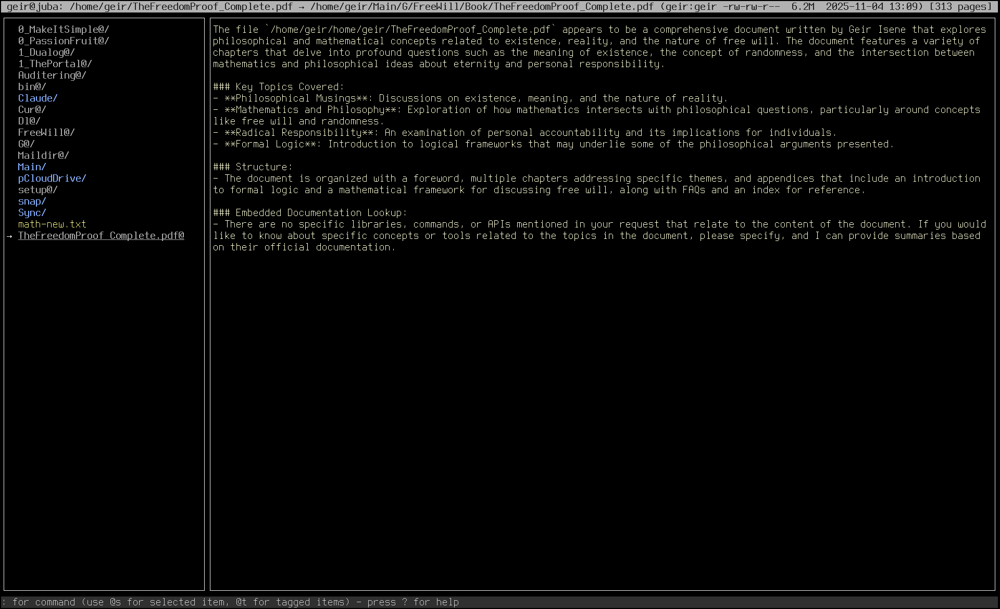
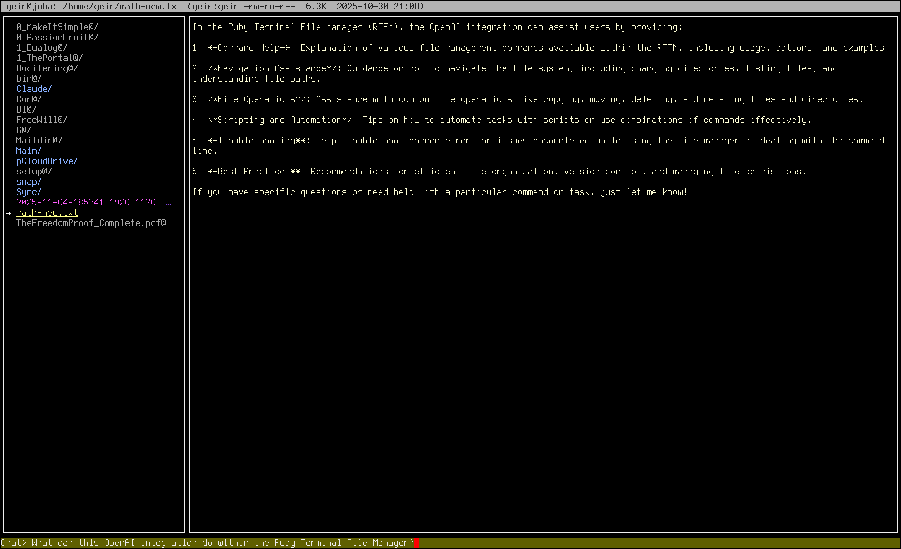
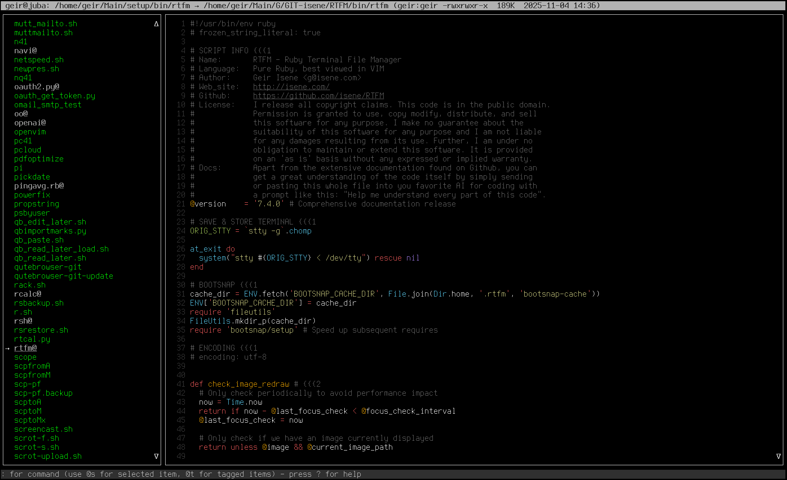
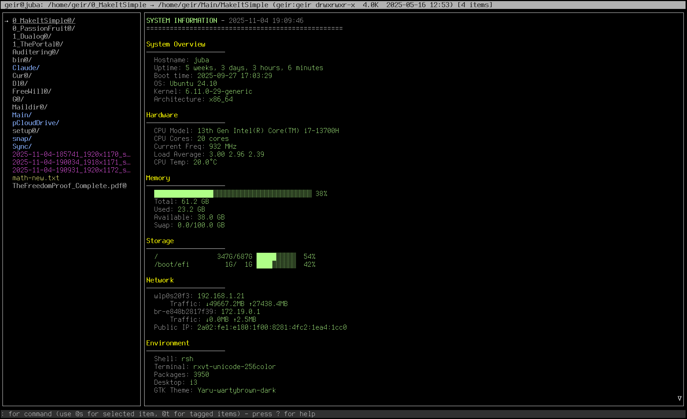

# RTFM - Ruby Terminal File Manager

 [](https://badge.fury.io/rb/rtfm-filemanager)  [](docs/) 


A feature-rich terminal file manager written in pure Ruby. Browse directories with syntax-highlighted previews, inline images, remote SSH/SFTP access, comprehensive undo system, OpenAI integration, and much more.

RTFM parses your LS_COLORS for consistent terminal theming and runs on any modern terminal emulator.

<br clear="left"/>

## Quick Start

```bash
# Install
gem install rtfm-filemanager

# Run
rtfm

# Or start in specific directory
rtfm ~/Documents

# Press ? for help
```

After first run, use `r` command to launch RTFM and exit into your current directory.

---

## Screenshots

<details>
<summary>Click to view screenshots</summary>

### OpenAI File Analysis


### Interactive AI Chat


### Syntax Highlighting


### System Information


</details>

---

## Table of Contents

- [Key Features](#key-features)
- [Installation](#installation)
- [Keyboard Reference](#keyboard-reference)
- [Remote SSH/SFTP Browsing](#remote-sshsftp-browsing)
- [Configuration](#configuration)
- [OpenAI Integration](#openai-integration)
- [Plugins](#plugins)
- [Image Display](#image-display)
- [RTFM vs Ranger](#rtfm-vs-ranger)
- [Documentation](#documentation)

---

## Key Features

### File Operations
- **Comprehensive undo system** - Undo delete, move, rename, copy, symlink, permissions, ownership
- **Trash bin** - Optional safe deletion with restore capability
- **Bulk operations** - Copy, move, delete multiple tagged items
- **Bulk rename** - Pattern-based renaming (regex, templates, case conversion)
- **Permission management** - Change permissions with undo support (`755`, `rwxr-xr-x`, `+x`, `-w`)
- **Ownership management** - Change user:group with undo support

### Display & Preview
- **Syntax highlighting** - File content with bat/batcat
- **Inline images** - w3m and Sixel protocols via termpix gem
- **EXIF orientation** - Correct display of rotated images
- **Video thumbnails** - ffmpegthumbnailer integration
- **Archive preview** - View contents of .zip, .tar, .gz, .rar, .7z files
- **Document preview** - PDF, LibreOffice, MS Office files
- **LS_COLORS parsing** - Consistent terminal color theming

### Remote Operations
- **SSH/SFTP browsing** - Navigate remote directories seamlessly
- **Interactive SSH shell** - Drop into shell sessions on remote hosts
- **File transfer** - Download and upload files
- **Connection caching** - Smart caching for performance

### Advanced Features
- **Git integration** - Status display for repositories
- **Cryptographic hashing** - Directory tree verification
- **OpenAI integration** - File descriptions and interactive chat
- **Tab management** - Multiple tabs with duplication and renaming
- **Fuzzy search** - fzf integration
- **Navi integration** - Interactive command cheatsheets

### Developer Features
- **Plugin architecture** - Custom preview handlers and key bindings
- **Ruby debug mode** - Execute arbitrary Ruby in context
- **Command history** - Preserved across sessions
- **Extensible** - Clean plugin API

---

## Installation

### via RubyGems (Recommended)

```bash
gem install rtfm-filemanager
```

### Full Installation with All Features

#### Ubuntu/Debian:
```bash
sudo apt update
sudo apt install ruby-full x11-utils xdotool bat pandoc poppler-utils \
  odt2txt docx2txt unzip gnumeric catdoc w3m imagemagick \
  ffmpegthumbnailer tar gzip bzip2 xz-utils unrar p7zip-full

gem install rtfm-filemanager
```

#### macOS:
```bash
brew install ruby imagemagick w3m bat pandoc poppler

gem install rtfm-filemanager
```

### Dependencies

**Required:**
- Ruby 2.7+
- rcurses gem (~> 6.0)
- termpix gem (~> 0.2)

**Optional (for full functionality):**
- **ImageMagick** - Image preview (`identify`, `convert`)
- **w3m-img** - w3m image protocol
- **xdotool** - Image redraw on workspace switching
- **bat/batcat** - Syntax highlighting
- **fzf** - Fuzzy file finding
- **pandoc** - Document conversion
- **ffmpegthumbnailer** - Video thumbnails
- **ruby-openai** - AI integration

---

## Keyboard Reference

For complete reference: `man rtfm` or press `?` in RTFM

### Essential Keys

| Key | Action |
|-----|--------|
| `?` | Show help |
| `q` | Quit (save config) |
| `Q` | Quit (don't save) |
| `r` | Refresh display |

### Navigation

| Key | Action |
|-----|--------|
| `j` / `↓` | Move down |
| `k` / `↑` | Move up |
| `h` / `←` | Parent directory |
| `l` / `→` / `ENTER` | Enter directory / open file |
| `HOME` / `END` | First / last item |
| `PgUp` / `PgDn` | Page up / down |

### Marks & Jumping

| Key | Action |
|-----|--------|
| `m` + letter | Set bookmark |
| `'` + letter | Jump to bookmark |
| `~` | Jump to home |
| `>` | Follow symlink |
| `Ctrl-r` | Recent files/directories |
| `Ctrl-e` | Toggle remote SSH mode |

### Tagging

| Key | Action |
|-----|--------|
| `t` | Tag/untag item |
| `Ctrl-t` | Tag by pattern |
| `T` | Show tagged items |
| `u` | Untag all |

### File Operations

| Key | Action |
|-----|--------|
| `p` | Copy tagged items here |
| `P` | Move tagged items here |
| `s` | Create symlinks |
| `c` | Rename item |
| `E` | Bulk rename (patterns) |
| `d` | Delete (→ trash if enabled) |
| `D` | Empty trash |
| `Ctrl-d` | Toggle trash on/off |
| `U` | Undo last operation |

### Permissions

| Key | Action |
|-----|--------|
| `Ctrl-p` | Change permissions (with undo) |
| `Ctrl-o` | Change ownership (with undo) |

**Permission formats:** `755`, `rwxr-xr-x`, `rwx`, `+x`, `-w`, `+rw`

### Search & Filter

| Key | Action |
|-----|--------|
| `f` | Filter by extension |
| `F` | Filter by regex |
| `/` | Search and highlight |
| `n` / `N` | Next / previous match |
| `g` | Grep content |
| `L` | Locate files |
| `Ctrl-l` | Fuzzy find (fzf) |

### Display

| Key | Action |
|-----|--------|
| `-` | Toggle preview on/off |
| `_` | Toggle image preview |
| `b` | Toggle syntax highlighting |
| `w` | Change pane width |
| `B` | Cycle borders |
| `a` | Show/hide hidden files |
| `A` | Toggle long info (ls -l) |
| `o` | Change sort order |
| `i` | Invert sort |

### Clipboard

| Key | Action |
|-----|--------|
| `y` | Copy path (primary selection) |
| `Y` | Copy path (clipboard) |
| `Ctrl-y` | Copy image/text to clipboard |

### Git / AI / System

| Key | Action |
|-----|--------|
| `G` | Git status |
| `H` | Directory hash |
| `I` | OpenAI file description |
| `Ctrl-a` | OpenAI chat |
| `S` | System information |
| `X` | Compare two files |
| `e` | File properties |

### Tabs

| Key | Action |
|-----|--------|
| `]` | New tab |
| `[` | Close tab |
| `J` / `K` | Previous / next tab |
| `}` | Duplicate tab |
| `{` | Rename tab |
| `1-9` | Switch to tab # |

### Command Mode

| Key | Action |
|-----|--------|
| `:` | Execute shell command |
| `;` | Command history |
| `@` | Ruby debug mode |
| `§` | Force interactive mode (prefix) |
| `+` | Whitelist program as interactive |

**Interactive mode example:** `:§htop` - runs htop in full terminal

---

## Remote SSH/SFTP Browsing

Access and manage files on remote servers directly from RTFM.

### Activating Remote Mode

1. Press `Ctrl-e`
2. Enter connection string:
   ```
   user@server.com:/path/to/directory
   ```

### Connection Formats

```bash
# Basic SSH
user@server.com:/path

# Custom SSH key
-i ~/.ssh/custom-key user@server.com:/path

# SSH URI
ssh://user@server.com/path

# With comment
user@server.com:/path # Production server
```

### Remote Mode Keys

| Key | Action |
|-----|--------|
| `←` / `h` | Parent directory |
| `→` / `ENTER` | Enter dir / show file info |
| `d` | Download file |
| `u` | Upload tagged files |
| `s` | Open SSH shell |
| `Ctrl-e` | Exit remote mode |

**Visual indicator:** Red background when in remote mode

---

## Configuration

Configuration stored in `~/.rtfm/conf`

### Quick Config

| Action | Command |
|--------|---------|
| View config | Press `C` |
| Save config | Press `W` |
| Reload config | Press `R` |

### Common Settings

```ruby
# ~/.rtfm/conf

# Enable trash bin
@trash = true

# Toggle preview on/off
@preview = true

# Show/hide images
@showimage = true

# Show hidden files
@lsall = "-a"

# Show long file info
@lslong = true

# Pane width (2-7)
@width = 5

# Border style (0-3)
@border = 2

# OpenAI API key
@ai = "your-api-key-here"

# Directory bookmarks (persistent)
@marks = {"h" => "/home/user", "d" => "/home/user/Documents"}

# Command history (persistent)
@history = ["git status", "ls -la"]

# Interactive programs whitelist
@interactive = "htop,vim,emacs,nano"

# Top line background colors by path match
@topmatch = [["projects", 165], ["", 238]]
```

### Color Customization

```ruby
# Bottom pane
@bottomcolor = 238

# Command mode
@cmdcolor = 24

# Ruby mode
@rubycolor = 52

# OpenAI chat
@aicolor = 17
```

---

## OpenAI Integration

RTFM includes built-in AI features powered by OpenAI's API for intelligent file analysis and interactive assistance.

### Setup

1. **Get an API key:**
   - Sign up at https://platform.openai.com/
   - Generate an API key from your account settings

2. **Configure RTFM:**
   Add your API key to `~/.rtfm/conf`:
   ```ruby
   @ai = "sk-your-actual-api-key-here"
   @aimodel = "gpt-4o-mini"  # Optional: default model
   @aicolor = 17             # Optional: chat pane background color
   ```

The `ruby-openai` gem is already included as a dependency when you install RTFM.

### Features

#### File Description (Press `I`)

Get an intelligent summary of any file or directory:
- **Files:** Purpose, code review (for source files), library documentation lookup
- **Directories:** Overview of structure and contents
- **Git-aware:** Includes recent changes if in a git repository
- **Smart analysis:** Automatically includes preview content for context

Example uses:
- Understand unfamiliar codebases quickly
- Get code review suggestions (bugs, style, improvements)
- Learn what libraries/APIs are being used
- See git diff explanations in plain language

#### Interactive Chat (Press `Ctrl-a`)

Start a conversational AI assistant specialized in:
- File and directory questions
- Shell command help and suggestions
- Terminal workflow assistance
- Programming and scripting guidance

The chat maintains context throughout your RTFM session, so follow-up questions work naturally.

### Configuration Options

```ruby
# Model selection (in ~/.rtfm/conf)
@aimodel = "gpt-4o-mini"      # Fast, cost-effective (default)
@aimodel = "gpt-4o"           # More capable, higher cost
@aimodel = "gpt-4-turbo"      # Alternative high-end model

# Chat interface color
@aicolor = 17                 # Dark blue background (default)
```

### Cost & Privacy

- API calls cost money (typically $0.001-0.01 per request with gpt-4o-mini)
- File contents are sent to OpenAI when using `I` key
- No data is sent unless you explicitly press `I` or `Ctrl-a`
- Chat history persists only during your RTFM session

---

## Plugins

RTFM supports two types of plugins in `~/.rtfm/plugins/`:

### 1. Preview Handlers (`preview.rb`)

Add custom file type previews:

```ruby
# ~/.rtfm/plugins/preview.rb

# Syntax: ext1, ext2 = command with @s placeholder
# @s is replaced with shell-escaped filename

# Examples:
txt, log = bat -n --color=always @s
md = pandoc @s -t plain
pdf = pdftotext -f 1 -l 4 @s -
json = jq . @s
```

### 2. Custom Key Bindings (`keys.rb`)

Add or override key bindings:

```ruby
# ~/.rtfm/plugins/keys.rb

# Add new key binding
KEYMAP['Z'] = :my_custom_action

def my_custom_action(_chr)
  @pB.say("Custom action triggered!")
  # Use @pL, @pR, @selected, etc.
end

# Git commit shortcut example
KEYMAP['C-G'] = :git_commit

def git_commit
  message = @pCmd.ask('Commit message: ', '')
  shellexec("git add . && git commit -m '#{message}' && git push")
end
```

### Available Variables

| Variable | Description |
|----------|-------------|
| `@pT` | Top pane (info bar) |
| `@pL` | Left pane (file list) |
| `@pR` | Right pane (preview) |
| `@pB` | Bottom pane (status) |
| `@pCmd` | Command prompt |
| `@selected` | Currently selected file/dir |
| `@tagged` | Array of tagged items |
| `@external_program_running` | Set true when launching TUI programs |

### Plugin Helper Functions

```ruby
# Capture command output
output = command("ls -la", timeout: 5)

# Run command, show errors
shell("mv file1 file2", background: false)

# Run and show both stdout/stderr in right pane
shellexec("grep -r pattern .")
```

---

## Image Display

RTFM uses the [termpix](https://github.com/isene/termpix) gem for modern multi-protocol image display.

### Supported Protocols

| Terminal | Protocol | Status |
|----------|----------|--------|
| urxvt | w3m | ✓ Perfect |
| xterm | Sixel | ✓ Perfect |
| mlterm | Sixel | ✓ Perfect |
| kitty | w3m | ✓ Works (brief flash) |
| foot | Sixel | ✓ Perfect |

### Features

- **EXIF orientation** - Phone photos display correctly
- **Auto-detection** - Best protocol for your terminal
- **Aspect ratio** - Images never stretched
- **Toggle** - Press `_` to toggle image preview
- **Copy to clipboard** - Press `Ctrl-y` on image

### Terminal Compatibility

Best image experience with: urxvt, xterm, mlterm, Eterm

---

## RTFM vs Ranger

| Feature | RTFM | Ranger |
|---------|------|--------|
| **Language** | Pure Ruby | Python |
| **Size** | ~6K lines (single file) | ~22K lines (modular) |
| **License** | Unlicense (public domain) | GPL v3 |
| **LS_COLORS** | Native parsing | Requires theming |
| **Remote SSH/SFTP** | ✓ Built-in | ✗ |
| **Undo System** | ✓ Comprehensive | Limited |
| **Trash Bin** | ✓ With restore | ✗ |
| **OpenAI Integration** | ✓ | ✗ |
| **Permission/Ownership Undo** | ✓ | ✗ |
| **Image Protocols** | Sixel + w3m | Various (ueberzug, kitty) |
| **Tab Management** | ✓ Enhanced | ✓ Basic |
| **Bulk Rename** | ✓ Patterns | ✓ |
| **Plugin System** | Ruby-based | Python-based |
| **Community** | Small | Large (16.6k stars) |
| **Documentation** | Growing | Extensive |

**Philosophy:**
- **Ranger**: Minimalistic, "do one thing well"
- **RTFM**: Feature-packed, "jam packed with features"

**Best for:**
- **RTFM**: Power users wanting SSH workflows, undo, AI integration, maximum features
- **Ranger**: Users wanting clean, minimal, well-documented VIM-style navigation

---

## Documentation

- **Man page**: `man rtfm`
- **Interactive help**: Press `?` in RTFM
- **GitHub**: https://github.com/isene/RTFM
- **Changelog**: See [CHANGELOG.md](CHANGELOG.md)
- **Issues/Bugs**: https://github.com/isene/RTFM/issues

### Additional Guides

- [Getting Started](docs/getting-started.md) - Installation, first run, basic operations
- [Configuration Guide](docs/configuration.md) - Complete settings reference
- [Remote Browsing](docs/remote-browsing.md) - SSH/SFTP workflows
- [Plugin Development](docs/plugins.md) - Extend RTFM with custom handlers

---

## Screenshots


**Keyboard Cheat Sheet:**


---

## Latest Updates

### Version 7.3 Highlights

- **Modern image display** with termpix gem (Sixel + w3m protocols)
- **Performance optimizations** for large images
- **UTF-16 file support** for opening in $EDITOR
- **Image clipboard copy** (Ctrl-y)
- **Persistent selection** after operations

### Version 7.2 - BREAKING CHANGE

**Batch operations** now use consistent "tagged OR selected" logic:
- Tagged items exist → operate ONLY on tagged
- No tagged items → operate on selected

**Migration:** Explicitly tag selected item with `t` if you want it included.

See [CHANGELOG.md](CHANGELOG.md) for complete version history.

---

## How It Works

RTFM is a two-pane file manager with enhanced tab support:

- **Left pane**: Directory/file list with navigation
- **Right pane**: Preview, info, command output
- **Top bar**: Current path and file metadata
- **Bottom bar**: Status, prompts, commands
- **Tab indicator**: `[2/5]` shows current tab position

**Tab Features:**
- Multiple tabs for multi-directory management
- Duplicate tabs (`}`) to copy directory context
- Rename tabs (`{`) for organization
- Quick switch with number keys (1-9)

**Enhanced UX:**
- VIM-style navigation (hjkl)
- Arrow key support
- Persistent bookmarks and tagged items
- Command history across sessions
- Comprehensive undo for safety

---

## First Run

On first launch, RTFM:
1. Shows welcome message
2. Adds `r` function to your shell (~/.bashrc, ~/.zshrc)
3. Creates `~/.rtfm/` directory
4. Generates plugin templates

The `r` function lets you:
- Launch RTFM with single key
- Exit into RTFM's current directory (not launch directory)

**Workflow:**
```bash
r              # Launch RTFM
# Navigate to desired directory
q              # Exit RTFM
pwd            # You're in RTFM's last directory!
r              # Back into RTFM
```

---

## Why RTFM?

Created to solve a specific problem: file managers should parse LS_COLORS natively instead of requiring separate themes.

**The Origin Story:**

While working on a [complete LS_COLORS setup](https://github.com/isene/LS_COLORS), I realized creating a matching ranger theme was redundant. File managers should respect terminal colors by default.

This became RTFM - a file manager that parses LS_COLORS automatically.

**Why Rewrite?**

The old curses library was clumsy. So I created [rcurses](https://github.com/isene/rcurses) - a modern, pure Ruby curses implementation. From v5 onwards, RTFM runs on rcurses, providing:
- Better stability
- Cleaner code
- More features
- Active development

---

## Development

### For Users

Bug reports and feature requests welcome at: https://github.com/isene/RTFM/issues

### For Developers

**Ruby Debug Mode:**
Press `@` to enter Ruby REPL mode. Execute arbitrary Ruby code:
```ruby
# Examples:
puts @selected        # Show current selection
puts @tagged.inspect  # Show tagged items
puts @marks          # Show bookmarks
```

**Plugin Development:**
See `~/.rtfm/plugins/` directory for templates and examples.

**Contributing:**
This is a personal project built for my needs. Cool feature requests may be included. Code contributions welcome via pull requests.

---

## Author

**Geir Isene**
- Email: g@isene.com
- Web: https://isene.com
- GitHub: https://github.com/isene

## License

**Unlicense** - Public Domain

Permission granted to use, copy, modify, distribute, and sell this software for any purpose without restriction.

---

## See Also

- [rcurses](https://github.com/isene/rcurses) - Pure Ruby curses library
- [termpix](https://github.com/isene/termpix) - Terminal image display gem
- [ranger](https://github.com/ranger/ranger) - Python-based file manager
- [LS_COLORS](https://github.com/isene/LS_COLORS) - Comprehensive terminal color setup

---

**Stay Amazing** ✓
