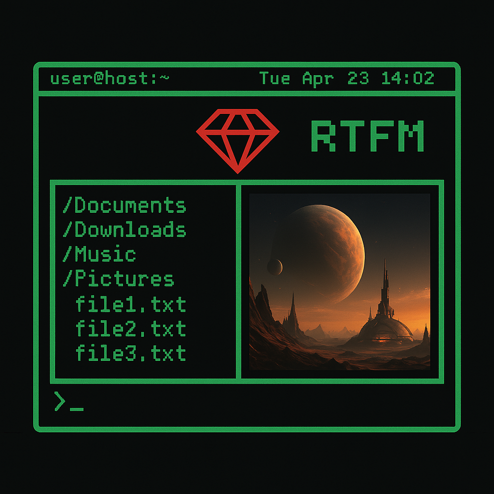
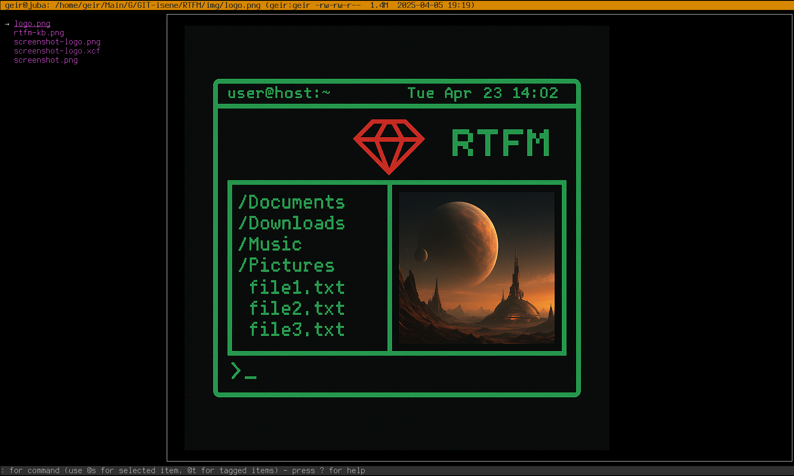

# RTFM - Ruby Terminal File Manager
 
 [](https://badge.fury.io/rb/rtfm-filemanager)  

## Version 5

Version 5 is a complete rewrite of RTFM using
[rcurses](https://github.com/isene/rcurses) as the underlying library. With
this, RTFM gains more stability, higher quality code and more features.

Among the new version 5 features are an optional trash bin, advanced OpenAI
integrations, plugin architectures for keybindings, user defined features and
file viewers. You also get better feedback, better visuals, more error
capture. Plenty.

The major feature additions in v5 are marked in ***bold italic***.

## What?  
 RTFM is a
terminal file manager jam packed with features. 

Apart from viewing and manipulating directories, you get syntax highlighting
of file content, image and video thumbnailing in the terminal, OpenAI
integration, system info panel, git status, fzf and navi integration and much,
much more.

Note: RTFM (Ruby Terminal File Manager) works best with the (u)rxvt, xterm and
Eterm terminal emulators.

### Features
RTFM is one of the most feature rich terminal file managers. Some of the
features are:

* RTFM parses your LS_COLORS to ensure color consistency with the terminal experience
* Images are shown inline in the terminal (can be turned off)
* File contents is shown with proper syntax highlighting
* Item's meta data is shown at the top
* Easily browse file content (pdf, MS/OpenOffice, etc.)
* Move around the file systems using arrow keys or VI keys
* Copy, move, rename, symlink and delete files easily
* Simply use 'r' in your terminal to launch RTFM - and exit into the directory where you ended RTFM
* ***Toggle the use of a "trash bin" to move dirs/files there instead of deleting***
* Easily copy an item's path to clipboard or primary selection
* Order items the way you want, see only files of a certain type
* Filter out all files not matching a [regex](https://www.rubyguides.com/2015/06/ruby-regex/) pattern
* Mark files and directories and do group actions on them
* Bookmark directories for easy jumping
* Follow a symlink to where it points with one key stroke
* Highlight files and directories matching a given pattern
* Find items using `locate` and jump directly to the desired item
* Find items and jump there using fuzzy search (with [fzf](https://github.com/junegunn/fzf))
* Execute any shell command from inside RTFM - ***incuding other curses applications***
* [navi](https://github.com/denisidoro/navi) integration for easier command executions
* Easily unpack or create archives
* Show git status for the current directory
* Show comprehensive system info (processes running, disk space, dmesg, etc.)
* See if a directory (with sub dirs) has changed using cryptographic hashes
* ***Remote directory browsing via SSH/SFTP*** with seamless navigation and file operations
* ***SSH shell integration*** for dropping into interactive shell sessions on remote hosts  
* ***Remote file operations*** including download, upload, and file info display
* Integration with OpenAI to get an executive summary of file content
* ***OpenAI chat integrated; Discuss files, content, commands with OpenAI***
* ***Enhanced tab management*** with duplication, renaming, and smart navigation
* ***Improved stability*** with simplified architecture and eliminated flickering
* ***Automatic image redraw*** after workspace switching (i3-wm compatible)
* Possibility to change top line background when matching a path
* Theming of pane colors

## Why?
The idea came to mind as I was working on [a complete LS_COLORS
setup](https://github.com/isene/LS_COLORS) with a corresponding
[ranger](https://ranger.github.io/) theme. But making a separate theme for
ranger to mimic a massive LS_COLOR setup is rather stupid. File managers
should parse LS_COLORS as default rather than implement their own themes. This
became an itch that I kept scratching until I could happily replace ranger two
weeks later. But, coding RTFM based on the old curses library was clumsy,
inefficient and painful. So I decided to create
[rcurses](https://github.com/isene/rcurses) - a complete curses library
written from scratch in pure Ruby - and from v5 and onwards, RTFM is based
completely on this modern curses implementation.

## How?
RTFM is a modern two-pane file manager with **enhanced tab support** for multi-directory navigation. You navigate in the left pane and the content of the selected item (directory or file) is shown in the right pane. The right pane is also used to show information such as the currently tagged items, your (book)marks, output from commands, error messages, etc.

The **tab system** is visible in the top-right corner showing your current position like `[2/5]` (tab 2 of 5 total tabs). The tab bar displays when you have multiple tabs or use tab commands, showing directory names and management shortcuts.

**Enhanced Tab Features:**
* **Multiple tabs** for easy multi-directory management  
* **Tab duplication** (`}`) to quickly copy current directory context
* **Tab renaming** (`{`) for better organization  
* **Smart tab display** showing current directory and shortcuts
* **Quick tab switching** with number keys (1-9), J/K navigation
* **Visual tab indicator** in top-right corner `[current/total]` 

When you start RTFM, you can supply a directory path as an argument to let
RTFM start up in that directory. When you exit it exits into the current RTFM
directory.

You can run any command in the bottom "command bar" and have the output
presented in the right pane. History of commands are preserved like in your
shell.

## Remote Directory Browsing

RTFM includes comprehensive **remote directory browsing** capabilities via SSH/SFTP, allowing you to seamlessly navigate and manage files on remote servers directly from your local terminal.

**Key Remote Features:**
* **Seamless remote navigation** - Browse remote directories as if they were local
* **SSH shell integration** - Drop into interactive shell sessions with `s` key
* **File operations** - Download (`d`), upload (`u`), and view file info (`→`)
* **Connection caching** - Intelligent caching for improved performance
* **Multiple connection formats** supported

**Connection Examples:**
```bash
# Basic SSH connection
user@server.com:/path/to/directory

# With custom SSH key
-i ~/.ssh/custom-key user@server.com:/path

# SSH URI format  
ssh://user@server.com/path/to/directory

# Key at end format
user@server.com:/path -i ~/.ssh/custom-key
```

**Remote Mode Usage:**
1. Press `Ctrl+E` to enter/exit remote mode
2. Enter connection string when prompted
3. Navigate with standard keys (`←`, `→`, `↑`, `↓`)
4. Use `d` to download files, `u` to upload files
5. Press `s` to open SSH shell in current remote directory
6. Press `Ctrl+E` to return to local mode

The remote browsing feature includes visual indicators (red background) to clearly show when you're in remote mode, and all standard RTFM navigation and information features work seamlessly with remote directories.

## Installation
You can install RTFM by cloning this repo and put the file `rtfm` in your
"bin" directory. If you do, you need to install
[rcurses](https://github.com/isene/rcurses) first.

Or you can simply run `gem install rtfm-filemanager`.

There are two basic prerequisites needed: `x11-utils` and `xdotool`. On
Ubuntu these would be installed via `apt install x11-utils xdotool`.

Content of text files are handled by `cat` - or by `bat` if you want beautiful
highlighting. Other files are shown via external programs (Debian/Ubuntu
family of Linux distros command in last column):

File type                   | Requirements                     | Installation
----------------------------|----------------------------------|-------------------------------
Syntax highlighting of text | `bat`                            | `apt install bat`
Markdown                    | `pandoc`                         | `apt install pandoc`
PDFs                        | `pdftotext`                      | `apt install poppler-utils`
LibreOffice                 | `odt2txt`                        | `apt install odt2txt`
MS docx                     | `docx2txt`                       | `apt install docx2txt`
MS pptx                     | `unzip`                          | `apt install unzip`
MS xlsx                     | `ssconvert`                      | `apt install gnumeric`
MS doc/xls/ppt              | `catdoc`, `xls2csv` and `catppt` | `apt install catdoc`
Images                      | `w3m` and `ImageMagick`          | `apt install w3m imagemagick`
Video (thumbnails)          | `ffmpegthumbnailer`              | `apt install ffmpegthumbnailer`

Install rtfm from scratch with all of the above on Ubuntu:
```
sudo apt update
sudo apt install ruby-full git libncurses-dev x11-utils xdotool bat pandoc poppler-utils odt2txt docx2txt unzip gnumeric catdoc w3m imagemagick ffmpegthumbnailer
sudo gem install rcurses
git clone https://github.com/isene/RTFM
cd RTFM
sudo cp rtfm /usr/bin/
```
Or with a simpler gem install:
```
sudo apt update
sudo apt install ruby-full git libncurses-dev x11-utils xdotool bat pandoc poppler-utils odt2txt docx2txt unzip gnumeric catdoc w3m imagemagick ffmpegthumbnailer
gem install rtfm-filemanager
```

## Screenshot



## Image preview in the terminal
RTFM uses w3mimgdisplay (part of the w3m package) to show images in the
terminal. Some terminals have an issue with this - either the images don't
show, the previous image is not cleared (new image overlaps the previous) or
they show for only a flash or a few seconds. The table below shows how the
most popular terminals fare with this. An "O" indicates that the terminal is
OK, while an "X" indicates that it fails:

Terminal      |Images | No overlap | Images stay
--------------|-------|------------|-----------
(u)rxvt       |   O   |    O       |   O
xterm         |   O   |    O       |   O
Eterm         |   O   |    O       |   O
kitty         |   O   |    O       |   O
alacritty     |   O   |    O       |   X
terminology   |   O   |    O       |   X
stterm        |   O   |    O       |   X
gnome-terminal|   O   |    X       |
xfce4-terminal|   O   |    X       |
mate-terminal |   O   |    X       |
lilyterm      |   O   |    X       |
termit        |   X   |            |
lxterminal    |   X   |            |
qterminal     |   X   |            |


## Keys
These are the set of keys to move around and do actions within RTFM:

### Basic keys
Key      | Description
---------|------------------------------------------------------------------
 ?       | Show this help text
 v       | Display RTFM version (and latest Gem version) in bottom window/command bar
 r       | Refresh RTFM (recreates all windows. Use on terminal resize or when there is garbage somewhere)
 R       | Reload configuration (~/.rtfm/conf)
 W       | Write parameters to ~/.rtfm/conf: @marks, @hash, @history, @rubyhistory, @aihistory, @lslong, @lsall, @lsorder, @lsinvert, @width, @border, @preview, @trash
 C       | ***Show the current configuration in ~/.rtfm/conf***
 q       | Quit (save basic configuration: @marks, @hash, @history, @rubyhistory, @aihistory)
 Q       | QUIT (without writing any changes to the config file)

### Layout
Key      | Description
---------|------------------------------------------------------------------
 w       | Change the width of the left/right panes (left pane ⇒ 20%, 30%, 40%, 50%, 60%)
 B       | Cycle border
 \-       | (Minus sign) Toggle preview in right pane (turn it off for faster traversing of directories)
 _       | (Underscore) Toggle preview of images in right pane
 b       | Toggle syntax highlighting (and line numbering)

### Motion
Key      | Description
---------|------------------------------------------------------------------
 j/DOWN  | Go one item down in left pane (rounds to top)
 k/UP    | Go one item up in left pane (rounds to bottom)
 h/LEFT  | Go up one directory level
 l/RIGHT | Enter directory or open file (using run-mailcap or xdg-open) Use the key 'x' to force open using xdg-open (or run-mailcap) - used for opening html files in a browser rather than editing the file in your text editor
 PgDown  | Go one page down in left pane
 PgUp    | Go one page up in left pane
 END     | Go to last item in left pane
 HOME    | Go to first item in left pane

### Marks and jumping
Key      | Description
---------|------------------------------------------------------------------
 m       | Mark current dir (persistent). Next letter is the name of the mark [a-zA-Z'] The special mark "'" jumps to the last directory (makes toggling dirs easy) Press '-' and a letter to delete that mark. Mark '0' is the dir where RTFM was started.  Marks '1' - '5' are the past five directories visited
 M       | Show marked items in right pane
 '       | Jump to mark (next letter is the name of the mark [a-zA-Z']) The 5 latest directories visited are stored in marks 1-5 (1 being the very latest)
 ~       | Jump to Home directory
 \>       | Follow symlink to the directory where the target resides

### Directory views
Key      | Description
---------|------------------------------------------------------------------
 a       | Show all (also hidden) items
 A       | Show long info per item (show item attributes)
 o       | Change the order/sorting of directories (circular toggle)
 i       | Invert/reverse the sorting
 O       | Show the Ordering in the bottom window (the full ls command)

### Tagging
Key      | Description
---------|------------------------------------------------------------------
 t       | Tag item (toggles)
 Ctrl-t  | Add items matching a pattern to list of tagged items (Ctrl-t and then . will tag all items)
 T       | Show currently tagged items in right pane
 u       | Untag all tagged items

### Tab management
Key      | Description
---------|------------------------------------------------------------------
 ]       | Create new tab in current directory
 [       | Close current tab (keeps at least one tab open)
 J       | Previous tab (wraps around)
 K       | Next tab (wraps around)
 }       | Duplicate current tab (creates a copy with same directory)
 {       | Rename current tab
 1-9     | Switch to tab by number (1 = first tab, 2 = second tab, etc.)

### Manipulate items
Key      | Description
---------|------------------------------------------------------------------
 p       | Put (copy) tagged items here
 P       | PUT (move) tagged items here
 c       | Change/rename selected (adds command to bottom window)
 s       | Create symlink to tagged items here
 d       | Delete selected item and tagged items. Confirm with 'y'. ***Moves items to trash directory (~/.rtfm/trash/) if @trash | true***
 D       | ***Empty trash directory***
 Ctrl-d  | ***Toggle use of trash directory***
 Ctrl-o  | Change ownership to user:group of selected and tagged items
 Ctrl-p  | Change permissions of selected and tagged items
           Format | rwxr-xr-x or 755 or rwx (applies the trio to user, group and others)

### Filter and search
Key      | Description
---------|------------------------------------------------------------------
 f       | Show only files in the left pane matching extension(s) (e.g. "txt" or "pdf,png,jpg")
 F       | Show only files matching a pattern (Ruby Regex) (e.g. "abc" or "ab.+12(\w3)+")
 Ctrl-f  | Clear all filtering
 /       | Enter search string in bottom window to highlight matching items and jump to the first match
 \\       | Remove search pattern
 n       | Jump to the next item matched by '/'
 N       | Jump to the previous item matched by '/'
 g       | Run 'grep' to show files that contains the MATCH in current directory
 L       | Start 'locate' search for files, then use '#' to jump to desired line/directory
 Ctrl-l  | Locate files via fzf from the current directory down (fuzzy file finder must be installed https://github.com/junegunn/fzf)

### Archives
Key      | Description
---------|------------------------------------------------------------------
 z       | Extract tagged zipped archive to current directory
 Z       | Create zipped archive from tagged files/directories

### Git/hash/openai
Key      | Description
---------|------------------------------------------------------------------
 G       | Show git status for current directory
 H       | Do a cryptographic hash of the current directory with subdirs. If a previous hash was made, compare and report if there has been any change
 I       | Show OpenAI's description of the selected item and its content (if available). You must have installed the ruby-openai gem and added your openai secret key in the ~/.rtfm/conf (add `@ai | "your-secret-openai-key") for this to work.
 Ctrl-a  | ***Start an OpenAI chat (the context window is kept until you exit RTFM). The OpenAI agent is specialized in answering questions about cli, files and dirs***

### Right pane controls
Key      | Description
---------|------------------------------------------------------------------
 ENTER   | Refresh the right pane
 S-RIGHT | ***One line down in the preview***
 S-LEFT  | ***One line up in the preview***
 S-DOWN  | ***Next page of the preview (if doc long and ∇ in the bottom right)*** (TAB does the same)
 S-UP    | ***Previous page (if you have moved down the document first - ∆ in the top right)*** (or S-TAB)

### Clipboard copy
Key      | Description
---------|------------------------------------------------------------------
 y       | Copy path of selected item to primary selection (for pasting with middle mouse button)
 Y       | Copy path of selected item to clipboard
 Ctrl-y  | Copy content of right pane to clipboard (turn off batcat syntax highlighting with 'b' for a clean copy of content)

### System shortcuts
Key      | Description
---------|------------------------------------------------------------------
 S       | Show comprehensive System info (system, CPU, filesystem, latest dmesg messages)
 =       | Create a new directory (a shortcut for ":mkdir ")
 Ctrl-n  | Invoke navi (see https://github.com/denisidoro/navi) with any output in right window

### Command mode
Key      | Description
---------|------------------------------------------------------------------
 :       | Enter "command mode" in bottom window (press ENTER to execute, press ESC to escape). Prefix the command with a '§' to force the program to run in interactive mode (full screen TUI programs like htop, vim or any shell)
 ;       | Show command history in right pane
 \+       | ***Add program(s) to the list of full-UI interactive terminal programs***


### Ruby debug mode
Key      | Description
---------|------------------------------------------------------------------
 @       | Enter Ruby mode to execute any Ruby command (ENTER to execute, ESC to escape)


## Keyboard cheat sheet


## First run
The first time you run RTFM, you are greeted with a welcome message. RTFM will
add a simple function to your shell (bash, zsh, fish, maybe others) that will
let you launch RTFM via the one key command `r`. It also lets RTFM exit in the
directory you are currently in (inside of RTFM) rather than where you launched
RTFM.

With this, you can jump around in your directory structure via RTFM, exit to
the desired directory, do work in the terminal and go back into RTFM via `r`.

If you want to launch rtfm straight into a specified directory, do this
instead: `rtfm ~/mydir/subdir`

## Configuration file
When you first exit RTFM, it will write your (book)marks and the set of tagged
files to `.rtfm/conf`. This ensures your marks and tagged files are
persistent. It also means you can launch rtfm tag a bunch of dirs and files,
drop out back to the terminal to do some work, back into rtfm and resume to
work with your previously tagged items.

You can also set persistent variables in the config file manually:

To have long info per item: `@lslong = true` (this is otherwise set to `false`)

To show hidden files: `@lsall = "-a"` (this is otherwise set to `""`)

To set a specific order for ls: `@lsorder = "-S"` (to order by size).

To revert your ls order: `@lsinvert = "-r"`

To set any additional 'ls' switches, set the variable `@lsuser`. To not list
any files containg the word "test", you could do this:
```
@lsuser = "--ignore=test"
```
To suppress image viewing in the terminal: `@showimage = false`

To suppress showing any content in the right pane: `@preview = false`

To change the default width of the left pane: `@width = 5` (experiment with numbers 2-8).

To toggle borders in RTFM: `@border = 1` (any number 0-3)

To have some commands already prepared for the command history, you can set:
```
@history = ["cat /home/me/MyTodo.txt", "neofetch --stdout"]
```
To open files with `run-mailcap` instead of `open-xdg` set:
```
@runmailcap = true
```
***To use the trash bin: `@trash = true`***

***To change the list of "whitelisted full-UI programs", change the variable @interactive.
This is a comma separated string listing all programs that can be run from
within RTFM's "command mode" (via the key `:`). Programs such as `htop`, `vim`
and all shells will take over the terminal when they run and need explicit
permission via this variable to be able to "replace" RTFM in the terminal.
When you exit such a whitelisted program, RTFM resumes control. If you try to
run such a program while it is not whitelisted, it will hang the terminal. To
add a program to the whitelist inside RTFM, press the `+` key. All ususal
shell comands that do not take over the full terminal such as `ls`, `touch`,
`neofetch`, etc. will run just fine in command mode without being whitelisted.
You can also explicitly run a program as interactive by prefixing the command
with a single `§` - e.g. `:` `§saidar`. Programs added to @interactive will
open as interactive also when opened via xdg-open or runmailcap (when you
press `RIGHT` on a selected item).***

All the variables above that you manually add to the top of the config files are
undisturbed by launching and exiting RTFM.

You can structure the config file the way you want. Let your OCD make it pretty.

You can use `W` inside of RTFM to write all the parameters mentioned above to
the config file - instead of adding them manually. Example: You press `+` to
add `emacs` to your list of whitelisted interactive programs. Then you would
want to press `W` to update @interactive in your config file so that `emacs`
is permanently whitelisted as an interactive program for you.

To exit RTFM without writing any changes to you marks or list of tagged items,
exit with `Q`. They will then remain the same as when you launched RTFM for
that session.

## Extra info
The top line shows information about the currently item in the left pane. When
you are at a file, the information is pretty self explanatory:

`Path: /home/geir/RTFM/README.md (-rw-r--r-- geir:geir 2023-04-25 11:49  16K)`

This shows the full path of the selected file as well as the permissions,
ownership, timestamp and the size of the file. When you are at a directory in
the left pane, you get two numbers in brackets. The first number is the number
of regular dirs/files in that directory. The second shows the total number of
entries, including the hidden directories and files:

`Path: /home/geir/RTFM (drwxr-xr-x geir:geir 2023-04-29 01:55  4,0) [4 8]`

Different file types may have extra self explanatory information included in
square brackets at the end of the top info line. Image files will have the
size of the image included while pdf files will have the number of pages. More
file specific information will be included when I feel like adding such.

## Top and bottom line background colors
You can customize the background colors for the top and bottom lines/panes.

Bottom color is by default `238`. Change it by setting @bottomcolor to your
desired colors in your `.rtfm/conf`.

You can also set the background color at the bottom when you enter command
mode (via `:`) by setting @cmdcolor and the Ruby mode (via `@`) by setting
@rubycolor.

Background color for OpenAI chats (invoked with `Ctrl-a`) is set with @aicolor.

You can set the variable `@topmatch` in your `.rtfm/conf` so that it will change
the background color of the top line/pane when you are in a directory matching
a pattern.

Example:
```
@topmatch =  [["passionfruit", 165], ["kiwi", 50], ["", 238]]
```
With this, the background color of the top line/pane will be set to `165` if
you are in a directory path that includes "passionfruits". The last pair is
the default background color when no match is found. If you don't set this
variable in your `.rtfm/conf`, rtfm will set this value to:
```
@topmatch =  [["", 238]]
```
Make sure to have a default value set as the last pair in `@topmatch`.

## Plugin architecture
***Upon first running RTFM, a few files are created in the `.rtfm/` directory.***

One is `preview.rb`, the other is `keys.rb`.

You can add new "previewers" to show files with extensions that is not
previewed by default in RTFM. The `preview.rb` explains how you add thesea:
```
# ~/.rtfm/preview.rb
#
# Define one handler per line in the form:
#
#   ext1, ext2, ext3 = command with @s placeholder
#
# @s will be replaced by the shell-escaped filename.
#
# Lines beginning with # or blank are ignored.
#
# Examples:
#   # plain text, Ruby, Python, shell
#   txt, rb, py, sh = bat -n --color=always @s
#
#   # markdown via pandoc
#   md = pandoc @s -t plain
#
#   # PDFs
#   pdf = pdftotext -f 1 -l 4 @s -
```
Likewise, you can add or rewrite any keys in RTFM and add new functionality to
RTFM by following the instructions in `keys.rb`:
```
# ~/.rtfm/keys.rb
#
# Override or add key bindings simply by assigning into KEYMAP
# and defining the corresponding handler methods.
#
# Syntax:
#   KEYMAP['X'] = :my_handler
#
#   def my_handler(chr)
#     # anything you like - use @pB, @pR, Dir.pwd, etc.
#     @pB.say("You pressed X!")
#   end
#
# Examples:
#
#   # remap 'C' to show config
#   KEYMAP['C'] = :show_config
#
#   # add a new binding: 'Z'
#   KEYMAP['Z'] = :zap_all
#   def zap_all(_chr)
#     @pB.say("ZAPPED!")
#   end
```
Here is another example of what you could add as a plugin:
```
KEYMAP['C-G'] = :git_update

def git_update
  @pR.say("Updating...")
  message = @pCmd.ask('Commit message: ', '')
  shellexec("git add . && git commit -m '#{message}' && git push")
  @pB.full_refresh
end
```
***With this, you can mold RTFM to fit your needs better.***

When writing plugins, there are a few variables you should know:

Variable  | Description
----------|------------------------------------------------------------------
@pT       | Top pane (info bar)
@pL       | Left pane
@pR       | Right pane
@pB       | Bottom pane (status bar)
@pCmd     | Command pane (asking for commands to execute)
@pSearch  | Search pane (prompting for what to search for)
@pAI      | Pane for interacting with (Open)AI
@pRuby    | Ruby debug/command pane
@selected | The selected item in the Left pane

Here are three importan hook-ins to use with your plugins:

### Summary of overlap & choice
- **Use `command`** when you need to _capture_ output as a value (and optionally handle stderr yourself).
- **Use `shell`** for fire-and-forget side-effects where you don't care about stdout but still want error reporting.
- **Use `shellexec`** when you want both stdout and stderr printed into RTFM's Right pane automatically.

#### `command(cmd, timeout: 5, return_both: false) → String or [stdout, stderr]`
- **What it does:** Runs `bash -c cmd`, captures both stdout and stderr, enforces a timeout.
- **When to use:** Programmatically grab output (and optionally errors) of a shell command (e.g. building directory listings or previews).
- **Key points:**
  - By default prints stderr into the Right pane and returns stdout.
  - `return_both: true` returns `[stdout, stderr]` instead of auto-printing errors.
  - Times out after `timeout` seconds, killing the process if necessary.

#### `shell(cmd, background: false, err: nil) → nil`
- **What it does:** Fires off `cmd` via `system`, redirecting stderr into a log file (default: `$TMP/rtfm_err.log`), optionally in the background.
- **When to use:** Run side-effecting commands (e.g. `xdg-open`, `mv`) where you don't need stdout but still want error reporting.
- **Key points:**
  - If `background: true`, runs `cmd &`.
  - Any stderr output is read from the log and shown via `@pR.say`.
  - Doesn't return command output, errors only.

#### `shellexec(cmd, timeout: 10) → nil`
- **What it does:** A thin wrapper over `command(cmd, timeout:, return_both: true)` that _always_ prints both stdout and stderr into the Right pane.
- **When to use:** Run a command and echo both its stdout and any errors back to the user—e.g. interactive grep, locate, or other one-off shell tools.
- **Key points:**
  - Internally calls `command(..., return_both: true)`.
  - Prints stderr first, then stdout.
  - Doesn't return anything to the caller.

## Screencast
Here's a screencast for an early version of RTFM, but it shows the basic stuff:
[](https://youtu.be/ANUOlDryUng)

## Development
I don't expect this program to be used by others. I do this for my own
enjoyment and because I want a file manager that fits my needs better than any
others I have found. If you come up with a feature request I feel is cool, I
may include it. Bug reports are always welcome.

A note to developers: You can hit the "@" key to enter the Ruby debug mode
where anything you enter in the bottom command bar will be sent to the Ruby
eval() function and output to the right pane. You can for instance issue
`puts @searched` to see the currently active search pattern. 
