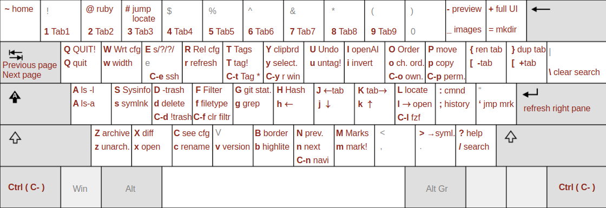

# RTFM - Ruby Terminal File Manager

 [](https://badge.fury.io/rb/rtfm-filemanager)  

What other features can I cram into this file manager?

## What?
RTFM is a file manager for the terminal written in Ruby. It lets you browse
directories and view the content of directories and files. Files are syntax
highlighted, images are shown in the terminal, videos are thumbnailed, etc.
You can bookmark and jump around easily, delete, rename, copy, symlink and
move files. RTFM has a a wide range of other features. Read on for what it can
do. RTFM consists of just one executable file and thereby easily ported across
systems.

Note: RTFM works best with the (u)rxvt, xterm and Eterm terminal emulators.

## Features

RTFM is one of the more feature rich terminal file managers. Some of the
features are:

* RTFM shows images inline in the terminal (can be turned off)
* File contents is shown with proper syntax highlighting
* Item's meta data is shown at the top
* Easily browse file content (even pdf, MS/OpenOffice, etc.)
* Move around the file systems using arrow keys of VI keys
* Copy, move, rename or delete files easily
* Create symlinks with just one key stroke
* Easily copy an item's path to clipboard or primary selection
* Order items the way you want
* See only files of a certain type
* Filter out all files not matching a [regex](https://www.rubyguides.com/2015/06/ruby-regex/) pattern
* Mark files and directories and do group actions on them
* Bookmark directories for easy jumping
* Follow a symlink to where it points with one key stroke
* Highlight files and directories matching a given pattern
* Find items using `locate` and jump directly to the desired item
* Find items and jump there using fuzzy search (uses
  [fzf](https://github.com/junegunn/fzf))
* Execute any shell command from inside RTFM
* [navi](https://github.com/denisidoro/navi) integration for easier command
  executions
* Easily unpack or create archives
* Show git status for the current directory
* Show comprehensive system info (processes running, disk space, dmesg, etc.)
* See if a directory (with sub dirs) has changed using cryptographic hashes
* Integration with OpenAI to get an executive summary of file content

## Why?
RTFM parses your LS_COLORS to ensure color consistency with the terminal experience.

The idea came to mind as I was working on [a complete LS_COLORS
setup](https://github.com/isene/LS_COLORS) with a corresponding
[ranger](https://ranger.github.io/) theme. But making a separate theme for
ranger to mimic a massive LS_COLOR setup is rather stupid. File managers
should parse LS_COLORS as default rather than implement their own themes. This
became an itch that I kept scratching until I could happily replace ranger two
weeks later.

## How?
RTFM is a two-pane file manager. You navigate in the left pane and the content
of the selected item (directory or file) is shown in the right pane. The right
pane is also used to show information such as the currently tagged items, your
(book)marks, output from commands, etc. 

When you start RTFM, you can supply a directory path as an argument to let
RTFM start up in that directory.

You can run any command in the bottom "command bar" and have the output
presented in the right pane. Use LEFT and RIGHT keys to go back and forth on
the command line, HOME to beginning of line, END to end of line, Backspace or
Ctrl-h to delete previous character, Ctrl-w to delete previous word, TAB to
complete directories and file names and ENTER to issue the command, while
Ctrl-u deletes the line. Issuing ENTER on a blank line has no effect. Use
Ctrl-g to leave the command bar without executing anything.

## Installation

You can install RTFM by coloning this repo and put the file `rtfm` in your
"bin" directory. Or you can simply run `gem install rtfm-filemanager`.

There are two basic prerequisites needed: `x11-utils` and `xdotool`. On
Ubuntu these would be installed via `apt install x11-utils xdotool`.

In order to run RTFM (without generating [a bunch of
warnings](https://github.com/isene/RTFM/issues/1)), you need to do a `gem
install curses` (gets version 1.3.2) instead of installing via `apt install
ruby-curses` (gets version 1.2.4-1build1 on Ubuntu 20.04). If you install RTFM
via `gem install rtfm-filemanager`, this dependency is already taken care of.

Content of text files are handled by `cat` - or by `bat` if you want beautiful
highlighting. Other files are shown via external programs (Debian/Ubuntu
family of Linux distros command in last column):

File type                   | Requirements                     | Installation
----------------------------|----------------------------------|-------------------------------
Syntax highlighting of text | `bat`                            | `apt install bat`
PDFs                        | `pdftotext`                      | `apt install poppler-utils`
LibreOffice                 | `odt2txt`                        | `apt install odt2txt`
MS docx                     | `docx2txt`                       | `apt install docx2txt`
MS pptx                     | `unzip`                          | `apt install unzip`
MS xlsx                     | `ssconvert`                      | `apt install gnumeric`
MS doc/xls/ppt              | `catdoc`, `xls2csv` and `catppt` | `apt install catdoc`
Images                      | `w3m` and `ImageMagick`          | `apt install w3m imagemagick`
Video (thumbnails)          | `ffmpegthumbnailer`              | `apt install ffmpegthumbnailer`

Install rtfm from scratch with all of the above on Ubuntu:
```
sudo apt update
sudo apt install ruby-full git libncurses-dev x11-utils xdotool bat poppler-utils odt2txt docx2txt catdoc w3m imagemagick ffmpegthumbnailer
sudo gem install curses
git clone https://github.com/isene/RTFM
cd RTFM
sudo cp rtfm /usr/bin/
```
Or with a simpler gem install:
```
sudo apt update
sudo apt install ruby-full git libncurses-dev x11-utils xdotool bat poppler-utils odt2txt docx2txt catdoc w3m imagemagick ffmpegthumbnailer
gem install rtfm-filemanager
```

## Screenshot


## Image preview in the terminal

RTFM uses w3mimgdisplay (part of the w3m package) to show images in the
terminal. Some terminals have an issue with this - either the images don't
show, the previous image is not cleared (new image overlaps the previous) or
they show for only a flash or a few seconds. The table below shows how the
most popular terminals fare with this. An "O" indicates that the terminal is
OK, while an "X" indicates that it fails:

Terminal      |Images | No overlap | Images stay
--------------|-------|------------|-----------
(u)rxvt       |   O   |    O       |   O
xterm         |   O   |    O       |   O
Eterm         |   O   |    O       |   O
kitty         |   O   |    O       |   O
alacritty     |   O   |    O       |   X
terminology   |   O   |    O       |   X
stterm        |   O   |    O       |   X
gnome-terminal|   O   |    X       |
xfce4-terminal|   O   |    X       |
mate-terminal |   O   |    X       |
lilyterm      |   O   |    X       |
termit        |   X   |            |
lxterminal    |   X   |            |
qterminal     |   X   |            |


## Keys

These are the set of keys to move around and do actions within RTFM:

### Basic keys 

Key    | Description
-------|------------------------------------------------------------------
?      | Show this help text
r      | Refresh RTFM (recreates the panes. Use on terminal resize or when there is garbage somewhere)
R      | Reload configuration (~/.rtfm.conf)
W      | Write parameters to ~/.rtfm.conf (@lsall, @lslong, @lsorder, @lsinvert, @border, @width, @preview, @tagged, @marks)
q      | Quit
Q      | QUIT (without writing changes to the config file)
v      | Display RTFM version in bottom command bar

### Motion

Key        | Description
-----------|------------------------------------------------------------------
DOWN or j  | Go one item down in left pane (rounds to top)
UP or k    | Go one item up in left pane (rounds to bottom)
LEFT or h  | Go up one directory level
RIGHT or l | Enter directory or open file (using xdg-open or run-mailcap). Use the key 'x' to force open using xdg-open (or run-mailcap). Use 'x' for opening html files in a browser rather than editing the file in your text editor.
PgDown     | Go one page down in left pane
PgUp       | Go one page up in left pane
END        | Go to last item in left pane
HOME       | Go to first item in left pane

### Jumping and marks

Key    | Description
-------|------------------------------------------------------------------
m      | Mark current dir (persistent). Next letter is the name of the mark [a-zA-Z'] The special mark "'" jumps to the last directory (makes toggling dirs easy) Press '-' and a letter to delete that mark
M      | Show marked items in right pane
'      | Jump to mark (next letter is the name of the mark [a-zA-Z']). The 5 latest directories visited are stored in marks 1-5 (1 being the very latest)
~      | Jump to Home directory
\>      | Follow symlink to the directory where the target resides

### Searching

Key    | Description
-------|------------------------------------------------------------------
/      | Enter search string in bottom command bar to highlight matching items and jump to the first match
\\	   | Remove search pattern
n      | Jump to the next item matched by '/'
N      | Jump to the previous item matched by '/'
g      | Run 'grep' to show files that contains the MATCH in current directory
L      | Start 'locate' search for files, then use '#' to jump to desired line/directory
Ctrl-l | Locate files via fzf from the current directory down (fuzzy file finder must be installed https://github.com/junegunn/fzf)

### Tagging

Key    | Description
-------|------------------------------------------------------------------
t      | Tag item (toggles)
Ctrl-t | Add items matching a pattern to list of tagged items (Ctrl-t and then . will tag all items)
T      | Show currently tagged items in right pane
u      | Untag all tagged items

### Manipulate items

Key    | Description
-------|------------------------------------------------------------------
p      | Put (copy) tagged items here
P      | PUT (move) tagged items here
s      | Create symlink to tagged items here
d      | Delete selected item and tagged items. Press 'y' to confirm
c      | Change/rename selected (adds the proper command to change in the command bar)
Ctrl-o | Change ownership to user:group of selected and tagged items
Ctrl-p | Change permissions of selected and tagged items. Format = rwxr-xr-x or 755 or rwx (applies the trio to user, group and others)
z      | Extract tagged zipped archive to current directory
Z      | Create zipped archive from tagged files/directories

### Directory views

Key    | Description
-------|------------------------------------------------------------------
a      | Show all (also hidden) items
A      | Show All info per item (show item attributes)
o      | Change the order/sorting of directories (circular toggle)
i      | Invert/reverse the sorting
O      | Show the Ordering in the bottom command bar (the full ls command)
G      | Show git status for current directory
H      | Do a cryptographic hash of the current directory with subdirs. If a previous hash was made, compare and report if there has been any change
I      | Show OpenAI's description of the selected item and its content (if available). You must have installed the ruby-openai gem and added your openai secret key in the .rtfm.conf (add `@ai = "your-secret-openai-key") for this to work. If RTFM is installed as a gem, the ruby-openai gem is included in the installation

### Right pane

Key    | Description
-------|------------------------------------------------------------------
ENTER  | Refresh the right pane
TAB    | Next page of the preview (if doc long and ∇ in the bottom right)
S-TAB  | Previous page (if you have moved down the document first - ∆ in the top right)
w      | Change the width of the left/right panes (left pane ⇒ 20%, 30%, 40%, 50%, 60%)
\-      | Toggle preview in right pane (turn it off for faster traversing of directories)
_      | Toggle preview of images in right pane
b      | Toggle syntax highlighting (and line numbering)

### Additional commands

Key    | Description
-------|------------------------------------------------------------------
f      | Show only files in the left pane matching extension(s) (e.g. "txt" or "pdf,png,jpg")
F      | Show only files matching a pattern (Ruby Regex) (e.g. "abc" or "ab.+12(\w3)+")
B      | Toggle border
:      | Enter "command mode" in bottom command bar (press ENTER to execute, press Ctrl-G to escape)
;      | Show command history in right pane
y      | Copy path of selected item to primary selection (for pasting with middle mouse button)
Y      | Copy path of selected item to clipboard
Ctrl-y | Copy content of right pane to clipboard
Ctrl-d | Create a new directory (a shortcut for ":mkdir ")
Ctrl-n | Invoke navi (see https://github.com/denisidoro/navi) with any output in right pane
S      | Show comprehensive system info (system, CPU, filesystem, latest dmesg messages)

## Keyboard cheat sheet


## First run
The first time you run RTFM, you are greeted with a welcome message. RTFM will
then create a file (`.rtfm.launch`) in your home directory that will let you
launch RTFM via the one key command `r`. It also lets RTFM exit in the
directory you are currently in (inside of RTFM) rather than where you launched
RTFM.

With this, you can jump around in your directory structure via RTFM, exit to
the desired directory, do work in the terminal and go back into RTFM via `r`.


## Configuration file
When you first exit RTFM, it will write your (book)marks and the set of tagged
files to `.rtfm.conf`. This ensures your marks and tagged files are
persistent. It also means you can launch rtfm tag a bunch of dirs and files,
drop out back to the terminal to do some work, back into rtfm and resume to
work with your previously tagged items.

You can also set persistent variables in the config file manually. At the top
of `.rtfm.conf` you can set the following:

To have long info per item: `@lslong = true` (this is otherwise set to `false`)

To show hidden files: `@lsall = "-a"` (this is otherwise set to `""`)

To set any additional 'ls' switches, set the variable `@lsuser`. To not list
any files containg the word "test", you could do this:
```
@lsuser = "--ignore=test"
```

To change the default width of the left pane to something other than ⅓rd of
the terminal width: `@width = 5` (would set the left pane width to 50% of the
window size).

To add borders in RTFM: `@border = true`

To have some commands already prepared for the command history, you can set:
```
@history = ["cat /home/me/MyTodo.txt", "neofetch --stdout"]
```
To open files with `run-mailcap` instead of `open-xdg` set:
```
@runmailcap = true
```

These variables that you manually add to the top of the config files are
undisturbed by launching and exiting RTFM.

You can also use `W` inside of RTFM to write all the parameters mentioned
above to the config file - instead of adding them manually.

To exit RTFM without writing any changes to you marks or list of tagged items,
exit with `Q`. They will then remain the same as when you launched RTFM for
that session.


## Extra info
The top line shows information about the currently item in the left pane. When
you are at a file, the information is pretty self explanatory:

`Path: /home/geir/RTFM/README.md (-rw-r--r-- geir:geir 2023-04-25 11:49  16K)`

This shows the full path of the selected file as well as the permissions,
ownership, timestamp and the size of the file. When you are at a directory in
the left pane, you get two numbers in brackets. The first number is the number
of regular dirs/files in that directory. The second shows the total number of
entries, including the hidden directories and files:

`Path: /home/geir/RTFM (drwxr-xr-x geir:geir 2023-04-29 01:55  4,0) [4 8]`

Different file types may have extra self explanatory information included in
square brackets at the end of the top info line. Image files will have the
size of the image included while pdf files will have the number of pages. More
file specific information will be included when I feel like adding such.

## Screencast
[](https://youtu.be/ANUOlDryUng)


## Development
I don't expect this program to be used by others. I do this for my own
enjoyment and because I want a file manager that fits my needs better than any
others I have found. If you come up with a feature request I feel is cool, I
may include it. Bug reports are always welcome.

A note to developers: You can hit the "@" key to enter the Ruby debug mode
where anything you enter in the bottom command bar will be sent to the Ruby
eval() function and output to the right pane. You can for instance issue
`puts @searched` to see the currently active search pattern. 
